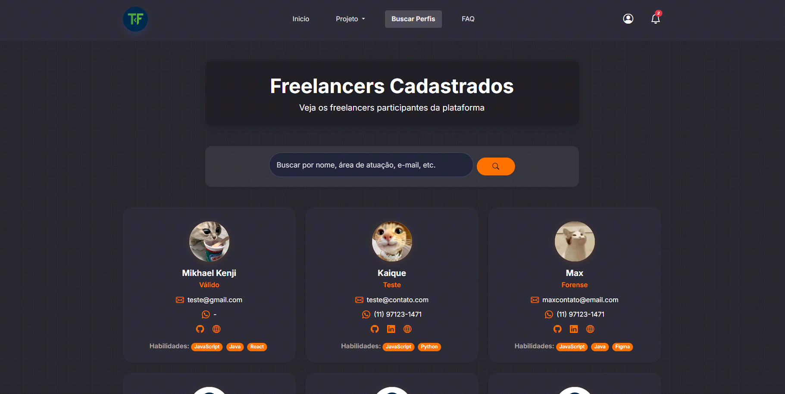

# TechFree

TechFree é uma plataforma digital desenvolvida para conectar programadores freelancers a empresas que buscam profissionais para desenvolvimento de projetos. O sistema oferece um ambiente seguro, transparente e eficiente para contratação, execução e avaliação de projetos de tecnologia.

---

## Sumário

- [Sobre o Projeto](#sobre-o-projeto)
- [Roles de Usuário](#roles-de-usuários)
- [Funcionalidades](#funcionalidades)
- [Arquitetura e Tecnologias](#arquitetura-e-tecnologias)
- [Instalação e Execução](#instalação-e-execução)
- [Estrutura de Pastas](#estrutura-de-pastas)
- [Principais Endpoints](#principais-endpoints)
- [Upload de Arquivos](#upload-de-arquivos)
- [Termos de Uso e Privacidade](#termos-de-uso-e-privacidade)
- [Contribuição](#contribuição)
- [Licença](#licença)
- [Autores](#autores)
- [Referências](#referências)
- [Screenshots](#screenshots)
- [Observações Finais](#observações-finais)

---

## Sobre o Projeto

TechFree foi desenvolvido como Trabalho de Graduação (TG) para a FATEC, com o objetivo de facilitar a contratação de freelancers de tecnologia por empresas, promovendo oportunidades, transparência e segurança para ambos os lados.

A plataforma atua como intermediária, permitindo que empresas publiquem vagas, freelancers se candidatem, ambos acompanhem o andamento dos projetos e realizem avaliações mútuas ao final de cada trabalho.

---

## Roles de Usuário

Na plataforma TechFree, há dois tipos de usuários com permissões e funcionalidades específicas:

- **Freelancer**: Usuário que se cadastra para buscar oportunidades de trabalho, criar e editar seu perfil, buscar perfis de empresas, se candidatar a vagas, acompanhar projetos, enviar e receber avaliações.
- **Empresa**: Usuário que se cadastra para publicar vagas, buscar perfis de freelancers, gerenciar projetos, enviar briefings, enviar e receber avaliações dos profissionais contratados.

---


## Funcionalidades

- **Cadastro e Login**: Usuários podem se cadastrar como freelancer ou empresa, realizar login, recuperar senha e gerenciar suas credenciais.
- **Dashboard**: Painel personalizado para cada tipo de usuário, com gráficos, relatórios e informações relevantes.
- **Perfil**: Edição de perfil, upload de avatar e assinatura (empresa), barra de progresso de perfil.
- **Publicação de Vagas**: Empresas podem publicar vagas, anexar briefing, definir requisitos, pagamento, duração, etc.
- **Upload de Arquivos**: Briefing, assinatura, avatar, com deleção automática do arquivo antigo ao enviar novo.
- **Busca de Perfis**: Empresas podem buscar freelancers e vice-versa.
- **Andamento de Projeto**: Acompanhamento do status do projeto, envio de arquivos, revisão, devolução e conclusão ou cancelamento.
- **Feedback e Avaliação**: Sistema de avaliação por estrelas e comentários ao final dos projetos.
- **Notificações**: Configuração de notificações por email e no site.
- **FAQ**: Página de perguntas frequentes.
- **Termos de Uso e Privacidade**: Documentação completa sobre direitos, deveres e tratamento de dados conforme LGPD.
- **Relatórios em PDF**: Geração de relatórios gráficos do dashboard usando jsPDF.

---

## Arquitetura e Tecnologias

**Backend:**  
- Java 21  
- Spring Boot 3.4.5  
- Spring Data JPA  
- Spring Security  
- Spring Mail  
- Thymeleaf  
- Lombok  
- MySQL 8  
- JWT para autenticação  
- Docker/Docker Compose  

**Frontend:**  
- HTML5, CSS3, JavaScript ES6+  
- Bootstrap 5  
- Quill.js (editor rich text)  
- jsPDF (relatórios em PDF)  

**Infraestrutura:**  
- Maven Wrapper  
- Dockerfile multi-stage  
- Docker Compose para orquestração (app + banco)  
- Pasta de uploads mapeada para persistência de arquivos  

---

## Instalação e Execução

### Pré-requisitos

- Docker e Docker Compose instalados
- Java 21 (para execução local sem Docker)
- MySQL 8 (para execução local sem Docker)

### Executando com Docker Compose

Execute o comando abaixo para iniciar o sistema:

```bash
docker-compose up --build
```


O backend estará disponível em http://localhost:8082  
O banco de dados estará disponível em localhost:3308  
Os arquivos enviados ficam em src/main/resources/uploads

### Executando Localmente (sem Docker)

Execute os comandos abaixo:

```bash
./mvnw clean package 
java -jar target/*.jar
```

Configure o banco de dados em src/main/resources/application.properties

---

## Estrutura de Pastas

```plaintext
TechFree/
├── src/
│   ├── main/
│   │   ├── java/com/techfree/        # Código fonte Java (controllers, models, services, repositories)
│   │   ├── resources/
│   │   │   ├── application.properties # Configuração Spring Boot
│   │   │   ├── static/                # Arquivos estáticos (JS, CSS, imagens)
│   │   │   ├── templates/             # Templates HTML (Thymeleaf)
│   │   │   └── uploads/               # Pasta para arquivos enviados (briefings, assinaturas, etc)
│   ├── test/
│   │   ├── java/com/techfree/         # Testes automatizados
├── target/                            # Build gerado pelo Maven
├── .mvn/                              # Maven Wrapper
├── pom.xml                            # Dependências e build Maven
├── Dockerfile                         # Build Docker multi-stage
├── docker-compose.yaml                # Orquestração de containers (app + MySQL)
├── .gitignore                         # Arquivos ignorados pelo Git
```
---

## Principais Endpoints

- /api/files/upload - Upload de arquivos (briefing, avatar)
- /empresa/upload-assinatura - Upload de assinatura da empresa
- /empresa/perfil - Atualização de perfil da empresa
- /freelancer/perfil - Atualização de perfil do freelancer
- /projetos - Publicação de vagas
- /empresa/perfil/verPerfil - Consulta perfil empresa
- /freelancer/perfil/verPerfil - Consulta perfil freelancer
- /dashboard/empresa/* e /dashboard/freelancer/* - Dados para gráficos do dashboard
- /avaliacoes/empresa e /avaliacoes/freelancer - Avaliação de projetos

---

## Upload de Arquivos

- Mecanismo: Spring Boot MultipartFile + JavaScript FormData
- Pasta física: src/main/resources/uploads (Docker: montada em /app/uploads)
- URL pública: /uploads/arquivo.ext (mapeada por WebConfig.java)
- Deleção automática: Ao enviar novo arquivo, o antigo é removido.

---

## Screenshots

### Tela de Início


### Cadastro de Freelancer


### Cadastro de Empresa


### Tela de Login


### Tela de Dashboard


### Tela de Perfil (Freelancer)


### Tela de Perfil (Empresa)


### Tela de Configurações


### Publicação de Vaga (Empresa)


### Buscar Vaga (Freelancer)


### Tela de Projeto (Freelancer)


### Tela de Projeto (Empresa)


### Edição de vaga


### Lista de Projetos (Freelancer)


### Lista de Projetos (Empresa)


### Listar Candidatos


### Andamento Projeto (Freelancer)


### Andamento Projeto (Empresa)


### Buscar Perfil Empresa (Freelancer)


### Buscar Perfil Freelancer (Empresa)


### Ver Perfil Empresa (Freelancer)


### Ver Perfil Freelancer (Empresa)


### Tela de FAQ


---

## Autores

Projeto desenvolvido por alunos da FATEC como Trabalho de Graduação:

|  [<br><sub>Max William Fonseca Ferreira</sub>](https://github.com/AXMW) | [<br><sub>Mikhael Kenji K R Garcia</sub>](https://github.com/Miskha01) |  [<br><sub>Kaique Machado Castro</sub>](https://github.com/KLinuxTS) |
| :---: | :---: | :---: |

- Pedro Lucas Nascimento Tavares
- [Ingrid Ferreira Silva](https://github.com/daisyisnothere)
  
